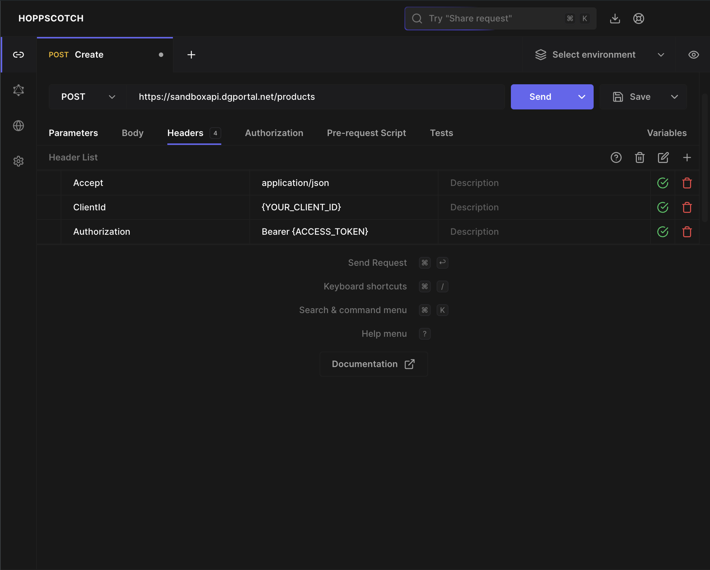
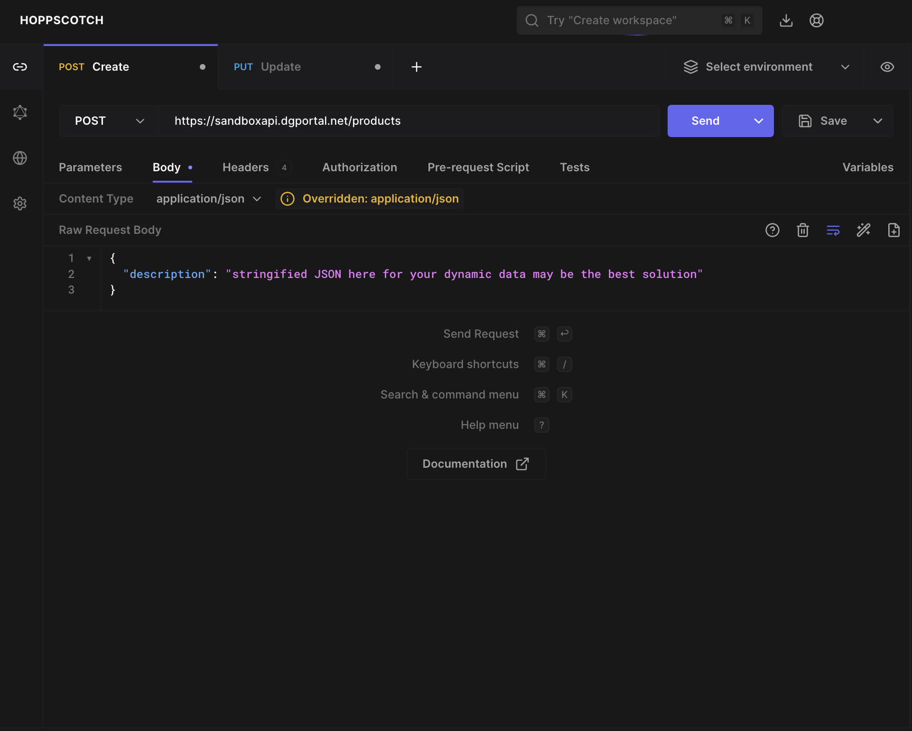
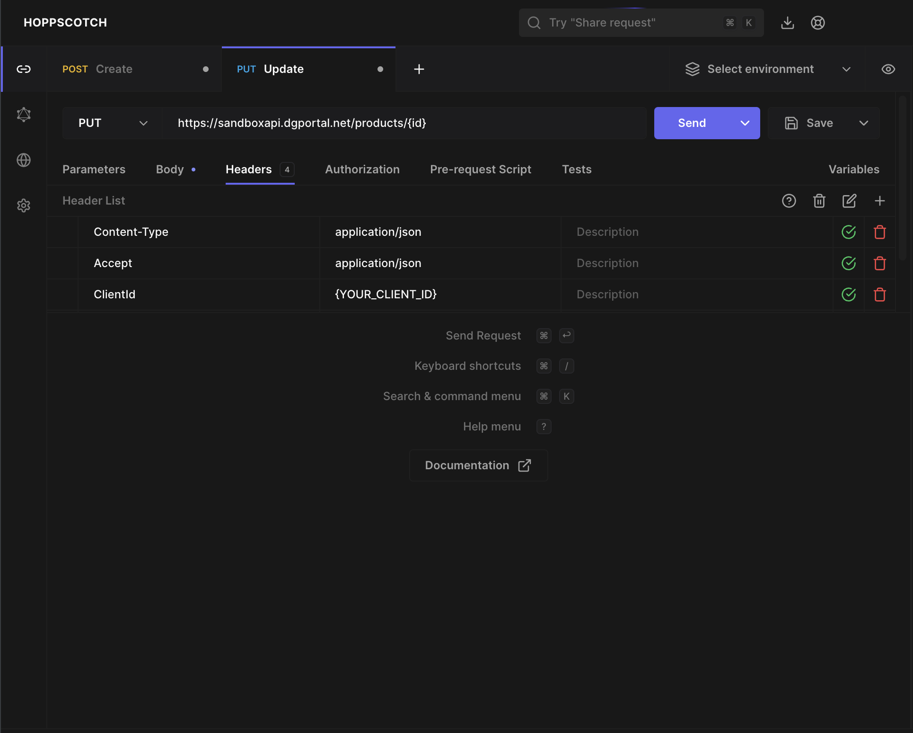
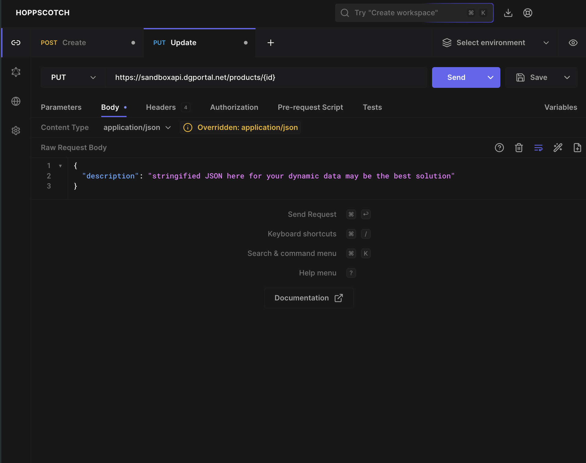

# Create a product

## cURL
```curl
curl -X POST "https://sandboxapi.dgportal.net/products" \
-H "Content-Type: application/json" \
-H "Accept: application/json" \
-H "ClientId: string" \
-H "Authorization: Bearer {access-token}" \
-d '{"description": "stringified JSON here for your dynamic data may be the best solution"}'

```

## Postman



## Vanilla
```
fetch('https://sandboxapi.dgportal.net/products', {
  method: 'POST',
  headers: {
    'Content-Type': 'application/json',
    'Accept': 'application/json',
    'ClientId': 'string',
    'Authorization': 'Bearer {access-token}'
  },
  body: JSON.stringify({
    description: "stringified JSON here for your dynamic data may be the best solution"
  })
})
.then(response => response.json())
.then(data => console.log(data))
.catch(error => console.error('Error:', error));

```
---
# Update a product

### cURL
```
curl -X PUT "https://sandboxapi.dgportal.net/products/{id}" \
-H "Content-Type: application/json" \
-H "Accept: application/json" \
-H "ClientId: string" \
-H "Authorization: Bearer {access-token}" \
-d '{"description": "stringified JSON here for your dynamic data may be the best solution"}'
```

## Postman



## Vanilla
```
fetch('https://sandboxapi.dgportal.net/products/{id}', {
  method: 'PUT',
  headers: {
    'Content-Type': 'application/json',
    'Accept': 'application/json',
    'ClientId': 'string',
    'Authorization': 'Bearer {access-token}'
  },
  body: JSON.stringify({
    description: "stringified JSON here for your dynamic data may be the best solution"
  })
})
.then(response => response.json())
.then(data => console.log(data))
.catch(error => console.error('Error:', error));
```